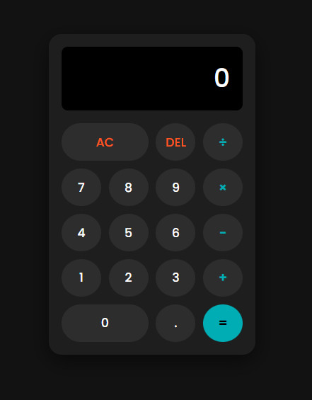

# 🧮 Calculadora Web Moderna


## 💻 Sobre o projeto

Uma calculadora totalmente funcional desenvolvida com tecnologias web modernas. O objetivo deste projeto foi praticar a manipulação do **DOM**, o uso de **CSS Grid** para layouts complexos e a lógica de programação com **JavaScript Vanilla** (sem frameworks).

O diferencial deste projeto é o foco na experiência do usuário (UX), implementando um design "Dark Mode" agradável e suporte completo para uso via teclado.

---

## ⚙️ Funcionalidades

- **Cálculos Básicos:** Adição, subtração, multiplicação e divisão.
- **Interface Responsiva:** O layout se adapta a diferentes tamanhos de tela (Mobile e Desktop).
- **Design Moderno:** Uso de variáveis CSS para criar um tema escuro consistente e botões estilizados.
- **Suporte a Teclado:** É possível digitar os números e operadores diretamente pelo teclado físico, além de usar `Enter` para igual e `Backspace` para corrigir.
- **Tratamento de Erros:** Prevenção de divisão por zero e erros de sintaxe.

---

## 🛠 Tecnologias Utilizadas

- **HTML5:** Estrutura semântica.
- **CSS3:** - **Flexbox:** Para alinhamento de containers.
  - **CSS Grid:** Para a organização precisa dos botões.
  - **CSS Variables:** Para fácil manutenção da paleta de cores.
- **JavaScript (ES6+):**
  - Manipulação de eventos (Click e Keydown).
  - Lógica matemática e tratamento de strings.

---

## 🎨 Layout

Você pode visualizar o layout do projeto através [deste link](https://eenzo71.github.io/modern-calculator-js/).



---

## 🚀 Como executar o projeto

1. Clone este repositório:
```bash
git clone https://github.com/Eenzo71/modern-calculator-js.git